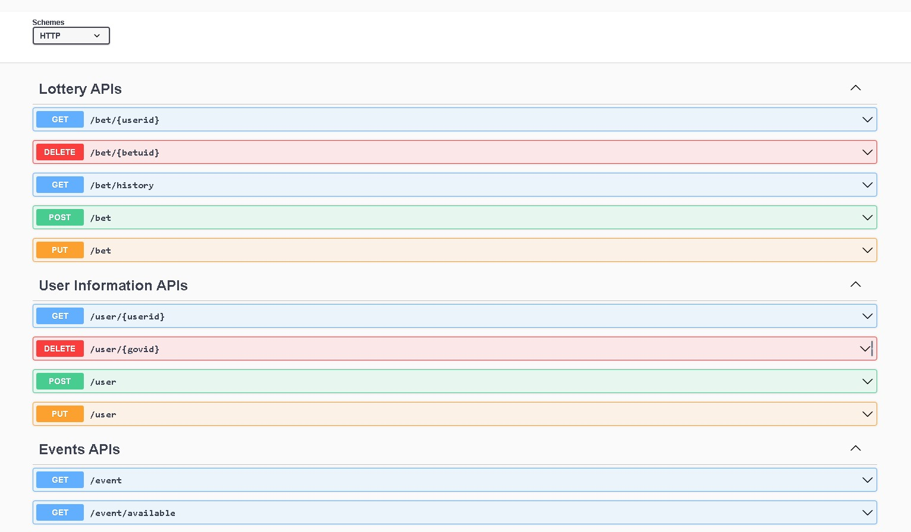
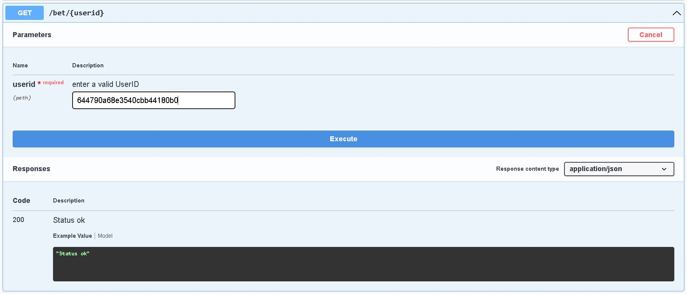
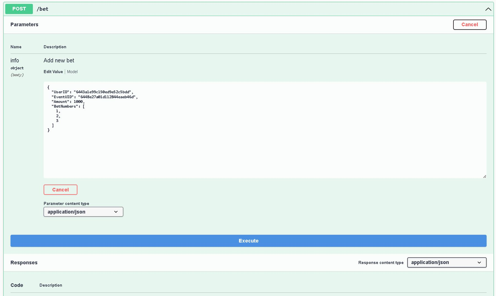
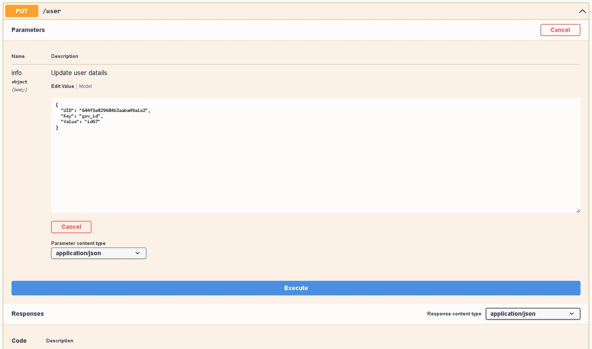
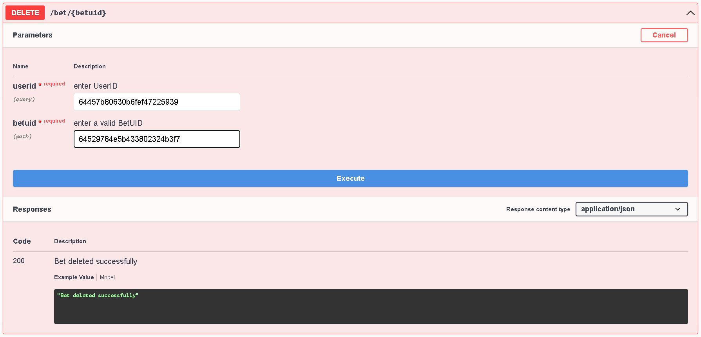

# Customer-manager APIs

Welcome to the Customer-manager APIs! This README provides an overview and instructions for using the Customer-manager APIs to retrieve and modify lottery-related information programmatically.

## Table of Contents

- Introduction
- API Endpoints
- Examples
- Error Handling

## Introduction

The Customer-managerAPIs provide a set of endpoints that allow developers to access user, event and lottery data of various lotteries, from the given collection. With these APIs, you can retrieve and modify information such as user registration, place betting numbers, winning numbers, jackpot amounts, event schedules, and more.

The following APIs are available:

## API Endpoints

1.`/bet/{userid}`

- Description: Retrieve a list of placed bets by the user.
- Request Types: GET
- Path Parameters:
  - {userid}: The unique id of the user.

2.`/bet/{betuid}`

- Description: Delete details for a specific placed bet.
- Request Types: DELETE
- Path Parameters:
  - {betuid}: The unique id of a placed bet.

3.`/bet/history`

- Description: Retrieve list of placed bets by a user for selected event type.
- Request Types: GET
- Query Parameters:
  - userid:The unique id of the user.
  - type: Type of lottery event.

4.`/bet`

- Description: Places/Updates a bet.
- Request Types:
  - POST: Creates a new bet.
  - PUT: Updates an already placed bet

5.`/user/{userid}`

- Description: Retrieve specific user information.
- Request Types: GET
- Path Parameters:
  - {userid}: The unique id of the user.

6.`/user/{govid}`

- Description: Delete details for a specific user.
- Request Types: DELETE
- Path Parameters:
  - {govid}: The unique government id of a user.

7.`/user`

- Description: Creates/Updates user information.
- Request Types:
  - POST: Creates a new user.
  - PUT: Updates an already existed user.

8.`/event`

- Description: Retrieve list of all events in database.
- Request Types: GET

9.`/event/available`

- Description: Retrieve list of upcoming events.
- Request Types: GET

## Examples

Here are a few examples to demonstrate how to use the Customer-manager APIs:

1.Retrieve a list of placed bets by a user.

2.Place a new bet.

3.Place a new bet.

4.Delete a bet.

## Error Handling

When an error occurs, the Lottery APIs return appropriate HTTP status codes along with error messages in the response body. Make sure to handle these errors gracefully in your application.
